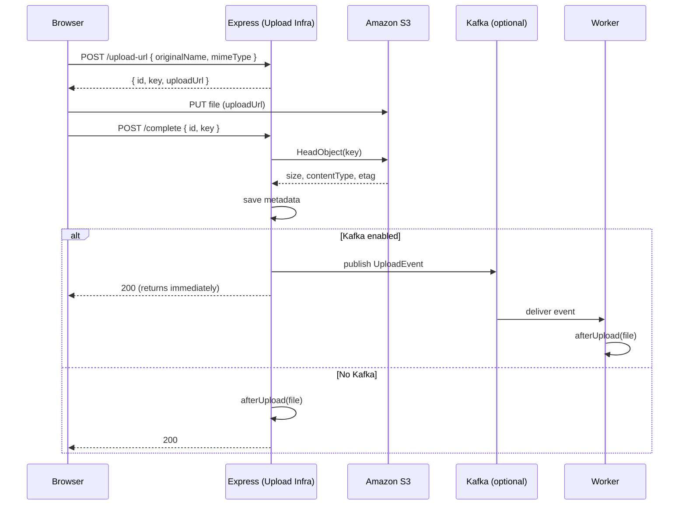

# lb-upload-infra

   

Plug-and-play S3 file upload and download for Express, with optional Kafka offloading for post-upload work.

Upload Infra gives you presigned S3 uploads, upload verification, metadata storage hooks, downloads, and optional Kafka workers, in a few lines of Express. It owns the upload infrastructure; your app keeps its own database and business logic.

## Architecture

```text
Browser
  | 1. POST /upload-url (ask for a presigned URL)
  v
Express + Upload Infra
  | 2. { id, key, uploadUrl }
  v
Amazon S3 <--- 3. PUT file (browser uploads straight to S3)
  |
  | 4. POST /complete (Upload Infra verifies with HeadObject)
  v
Express + Upload Infra
  |
  +--> Your metadata store save(file) --> Mongo / Postgres / anything
  |
  +--> Kafka (optional) publish --> Worker --> afterUpload()
```

One request path, two owners: Upload Infra owns the S3 and Kafka plumbing, your app owns the database and the afterUpload logic.

## When to use Upload Infra

Use Upload Infra if you:

- store files in Amazon S3 (or an S3-compatible service)
- want direct browser-to-S3 uploads, so files do not pass through your server
- want to keep file metadata in your own database
- optionally want async post-upload processing through Kafka

It is a thin infrastructure layer, not an ORM, a CMS, or a media-processing library.

## What Upload Infra does NOT do

Upload Infra does not:

- create S3 buckets or configure bucket CORS
- install or run Kafka
- manage your database (you provide save/find/delete)
- resize images, scan for viruses, or transcode media
- authenticate users for you (it gives you a hook)

Instead it gives you the hooks (metadata store, afterUpload, auth middleware) where your application does those things.

## Requirements

- Node.js 18 or newer
- An AWS account with an S3 bucket
- An Express app (Express 4 or 5)
- Somewhere to store metadata (MongoDB, PostgreSQL, DynamoDB, Redis, and so on)
- Kafka (optional, only for async offloading)

## Install

```bash
npm install lb-upload-infra express
```

Express is a peer dependency.

## Quick start (server)

```ts
import express from "express";
import { createUploader } from "lb-upload-infra";

const app = express();

const uploader = createUploader({
  s3: {
    region: process.env.AWS_REGION,
    bucket: process.env.S3_BUCKET,
    credentials: {
      accessKeyId: process.env.AWS_ACCESS_KEY_ID,
      secretAccessKey: process.env.AWS_SECRET_ACCESS_KEY,
    },
  },
  metadata: {
    save: async (file) => { /* insert file into your DB */ },
    find: async (id) => { /* return the file or null */ },
    delete: async (id) => { /* remove the file record */ },
  },
  afterUpload: async (file) => {
    // your business logic (thumbnails, scanning, and so on)
  },
});

app.use("/files", uploader.router());

async function start() {
  await uploader.ready();
  app.listen(3000);
}
start();
```

## Browser upload

From the browser it is three steps: ask for a URL, PUT the file to S3, tell the server you are done.

```ts
async function uploadFile(file) {
  // 1. Ask the server for a presigned URL.
  const res = await fetch("/files/upload-url", {
    method: "POST",
    headers: { "Content-Type": "application/json" },
    body: JSON.stringify({ originalName: file.name, mimeType: file.type }),
  });
  const { id, key, uploadUrl } = await res.json();

  // 2. Upload the bytes straight to S3.
  await fetch(uploadUrl, { method: "PUT", body: file });

  // 3. Tell the server the upload is done.
  await fetch("/files/complete", {
    method: "POST",
    headers: { "Content-Type": "application/json" },
    body: JSON.stringify({ id, key }),
  });
}
```

A full runnable page is in examples/frontend.html.

## How it works

```text
Browser -> POST /upload-url -> presigned URL -> PUT to S3 -> POST /complete
 -> HeadObject (verify) -> save metadata -> Kafka publish OR afterUpload -> done
```

On GitHub the same flow renders as a sequence diagram:



## HTTP API

Mounted under whatever base path you choose (here, /files):

| Method | Path | Body or params | Response |
| --- | --- | --- | --- |
| POST | /upload-url | { originalName, mimeType, size? } | { id, key, uploadUrl, expiresIn } |
| POST | /complete | { id, key } | { success, file } |
| GET | /:id | id in path | { ...metadata, downloadUrl } |
| DELETE | /:id | id in path | { success } |

At completion the client sends only the id and key it received from /upload-url. The content type is read from S3, the file name is taken from the key, and the key is checked to make sure it belongs to that id.

## Metadata: you own your database

Upload Infra never owns your database. It builds a metadata record and hands it to the three functions you provide:

```text
Upload Infra --save(file)--> your store --> Mongo | Postgres | DynamoDB | Redis | anything
```

```ts
interface FileMetadata {
  id: string;
  key: string;
  bucket: string;
  originalName: string;
  mimeType: string;
  size: number;
  etag: string;
  uploadedAt: string;
}
```

It stores the bucket and key, not a full URL, so switching to a CDN or a new region later does not require rewriting stored data. To get a URL, call GET /:id (a fresh presigned downloadUrl) or build one from the bucket and key.

```ts
metadata: {
  save: async (file) => { /* insert into your store */ },
  find: async (id) => fileOrNull,
  delete: async (id) => { /* remove from your store */ },
}
```

## Limits (optional)

Reject uploads that are too big or the wrong type. Checked at /complete against what S3 reports; a rejected object is deleted from S3 (best effort).

```ts
limits: {
  maxSizeBytes: 10 * 1024 * 1024,
  allowedMimeTypes: ["image/png", "image/jpeg", "application/pdf"],
}
```

## Errors

The router returns errors as { error: { code, message } }. The completion checks run in this order:

```text
POST /complete
  v
HeadObject()
  exists? --no--> 409 upload_incomplete
  v
size over maxSizeBytes? --yes--> delete object --> 413 file_too_large
  v
type allowed? --no--> delete object --> 415 invalid_file_type
  v
save metadata --> publish / callback --> 200
```

| Error | Status | Code |
| --- | --- | --- |
| ValidationError | 400 | validation_error |
| UnauthorizedError | 401 | unauthorized |
| NotFoundError | 404 | not_found |
| UploadIncompleteError | 409 | upload_incomplete |
| FileTooLargeError | 413 | file_too_large |
| InvalidFileTypeError | 415 | invalid_file_type |

These classes are exported, so you can throw or check them in your own code.

## Kafka (optional)

Why a separate worker? Background work should not block the HTTP response.

```text
Browser -> POST /complete -> save metadata -> publish to Kafka -> 200 (returns now)
                        |
                        v
                       Worker -> afterUpload()
```

Without Kafka, afterUpload runs inline during /complete. With Kafka, /complete returns as soon as the message is published, and a separate worker process runs afterUpload. You never publish or consume messages yourself.

```ts
kafka: {
  brokers: ["localhost:9092"],
  topic: "file-processing",
  // Optional: park messages that keep failing instead of retrying forever.
  deadLetterTopic: "file-processing-dlq",
}
```

Messages are published as an envelope, so consumers get an id and time too. Your afterUpload callback still receives the plain file.

```ts
interface UploadEvent {
  eventId: string;
  occurredAt: string;
  file: FileMetadata;
}
```

If afterUpload throws, the message is not committed, so Kafka delivers it again (at-least-once). Set deadLetterTopic to move failing or unreadable messages aside instead of retrying forever.

## Running: web server vs worker

createUploader does not start any background work on its own.

```ts
// web server: publishes only
await uploader.ready();
app.listen(3000);
```

```ts
// worker process: consumes and runs afterUpload
await uploader.startWorker();
```

Call uploader.close() on SIGINT/SIGTERM so Kafka disconnects cleanly.

## Deployment

Without Kafka, one process is enough:

```text
Browser -> Express (Upload Infra) -> Amazon S3
        |
        v
       Your database
```

With Kafka, run the API and the worker as separate processes, so API pods do not also become workers:

```text
Browser -> API pods (Express) -> Amazon S3
      |
      v
     Kafka -> Worker pods -> afterUpload()
```

A Docker Compose sketch (API and worker are the same image, different commands):

```yaml
services:
  api:
    command: node dist/server.js
  worker:
    command: node dist/worker.js
  kafka:
    image: apache/kafka:3.8.0
```

### Production checklist

- [ ] Configure S3 bucket CORS (see below)
- [ ] Give the app an IAM identity with least-privilege S3 access
- [ ] Pass secrets through environment variables, not code
- [ ] Protect the upload routes (auth)
- [ ] Point metadata save/find/delete at your real database
- [ ] Run the worker as a separate process or container
- [ ] Set a deadLetterTopic (or plan for retries)
- [ ] Serve over HTTPS

## CORS

Two different CORS settings matter, and both trip people up.

1. Express CORS, if your frontend is on a different origin than your API:

```ts
import cors from "cors";
app.use(cors({ origin: "https://your-app.com" }));
```

2. S3 bucket CORS, because the browser PUTs directly to S3. Add a rule to the bucket that allows PUT from your origin and exposes the ETag header:

```json
[
  {
    "AllowedOrigins": ["https://your-app.com"],
    "AllowedMethods": ["PUT", "GET"],
    "AllowedHeaders": ["*"],
    "ExposeHeaders": ["ETag"]
  }
]
```

## Auth (optional)

Pass any Express middleware through the auth option, or use the built-in bearer-token helper. Auth protects every route.

```ts
import { createUploader, bearerTokenAuth } from "lb-upload-infra";

const uploader = createUploader({
  s3: { /* ... */ },
  metadata: { /* ... */ },
  auth: bearerTokenAuth(process.env.UPLOAD_TOKEN),
});
```

Clients then send the header Authorization: Bearer <token>. Pass an array to accept several tokens, or bring your own JWT or session middleware. Presigned URLs grant temporary direct access to S3, so protect the routes that mint them.

## Configuration

| Option | Required | Default | Description |
| --- | --- | --- | --- |
| s3.region | yes | - | AWS region |
| s3.bucket | yes | - | S3 bucket name |
| s3.credentials | no | default AWS chain | accessKeyId, secretAccessKey, optional sessionToken |
| s3.endpoint | no | - | Custom S3-compatible endpoint (MinIO, R2, localstack) |
| s3.forcePathStyle | no | false | Path-style URLs (needed by some S3-compatible services) |
| s3.keyPrefix | no | uploads/ | Prefix for generated object keys |
| s3.uploadUrlExpiresIn | no | 900 | Upload URL lifetime in seconds |
| s3.downloadUrlExpiresIn | no | 900 | Download URL lifetime in seconds |
| metadata | yes | - | save, find, delete functions |
| afterUpload | no | - | Runs after a completed upload |
| limits.maxSizeBytes | no | - | Reject uploads larger than this many bytes |
| limits.allowedMimeTypes | no | - | Only allow these content types |
| kafka | no | - | brokers, topic, optional deadLetterTopic |
| auth | no | - | Express middleware to protect the routes |
| logger | no | console | Custom logger |

## Logging

Upload Infra logs the lifecycle through your logger (console by default):

```text
generated upload URL
verified upload
saved metadata
published upload event (Kafka mode)
afterUpload callback completed (inline mode)
kafka worker started (worker process)
deleted file
```

Pass your own logger (with info, warn, error) to integrate with pino, winston, and so on.

## Project structure

A typical app using Upload Infra has two entry points that share one config:

```text
your-app/
  src/
    uploader.ts # createUploader(...) config, imported by both entry points
    server.ts # HTTP: mounts uploader.router(), calls uploader.ready()
    worker.ts # Kafka: calls uploader.startWorker()
```

Two entry files exist because the API and the worker are different processes: server.ts handles HTTP and publishes, worker.ts consumes Kafka and runs afterUpload, and uploader.ts holds the shared config. See the examples/ folder: server.ts, worker.ts, and frontend.html.

## How Upload Infra compares

| | Upload through your server (e.g. multer) | Upload Infra |
| --- | --- | --- |
| Upload path | browser -> your server -> S3 | browser -> S3 directly (presigned) |
| Server load | buffers or streams the whole file | signs a URL and verifies |
| Metadata | you wire it up | you own it via save/find/delete |
| Async work | do it yourself | optional Kafka offloading |

## FAQ

- Do I need Kafka? No. Without it, afterUpload runs inline during /complete.
- Can I use MongoDB? Yes, in your metadata functions.
- Can I use PostgreSQL? Yes.
- Can I use MinIO, Cloudflare R2, or localstack? Yes. Set s3.endpoint (and often s3.forcePathStyle). Upload Infra targets Amazon S3 but uses the S3 client, so S3-compatible services work.
- Does the file pass through my server? No. The browser uploads directly to S3.

## Roadmap

- [x] Presigned S3 upload and download
- [x] Upload completion verification
- [x] Metadata store hooks
- [x] Optional Kafka offloading and dead-letter topic
- [x] Size and type limits
- [x] Bearer-token auth
- [ ] Multipart / large-file uploads
- [ ] Resumable uploads
- [ ] Browser client SDK
- [ ] CloudFront URL helper

## Local development

```bash
npm install
npm run build
npm test
```

Run a real Kafka broker and the end-to-end smoke test:

```bash
npm run kafka:up
npm run smoke:kafka
npm run kafka:down
```

## Troubleshooting

- CORS error on the S3 PUT: add the bucket CORS rule shown above (AllowedMethods PUT, ExposeHeaders ETag).
- CORS error calling /upload-url or /complete: add Express cors() for your frontend origin.
- "This server does not host this topic-partition" on the first Kafka publish: the topic was still being auto-created; pre-create it or retry, and later publishes succeed.
- 409 upload_incomplete: the object is not in S3 yet (the PUT did not finish, or the key does not match the id).

## License

MIT
